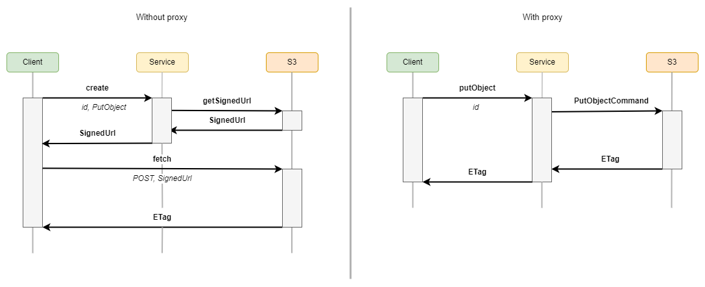
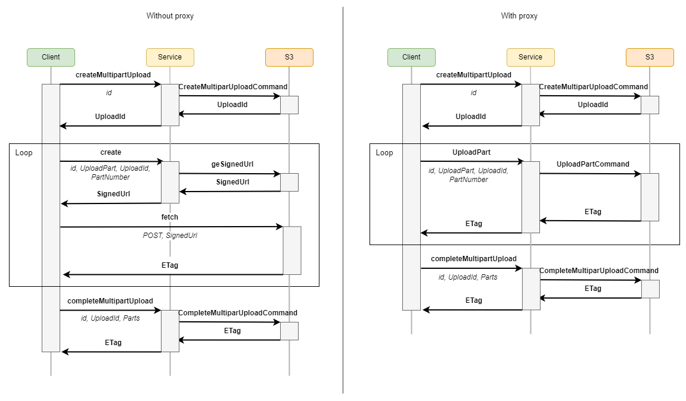
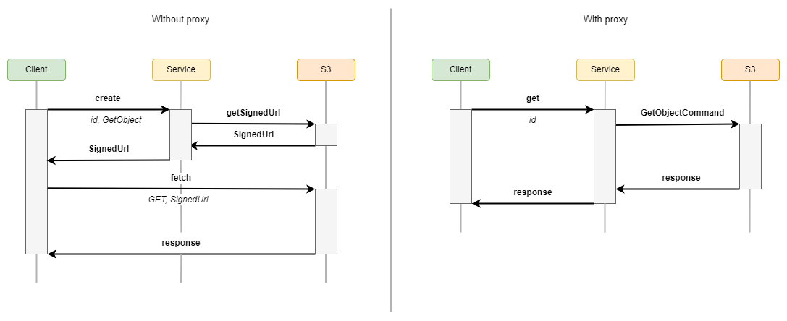

# feathers-s3

[](https://github.com/kalisio/feathers-s3/releases)
[](https://app.travis-ci.com/kalisio/feathers-s3)
[](https://codeclimate.com/github/kalisio/feathers-s3)
[](https://codeclimate.com/github/kalisio/feathers-s3/coverage)
[](https://www.npmjs.com/package/@kalisio/feathers-s3)

> `feathers-s3` allows to deal with [AWS S3 API](https://docs.aws.amazon.com/AmazonS3/latest/API/Welcome.html) compatble storages.

Unlike the solution [feathers-blob](https://github.com/feathersjs-ecosystem/feathers-blob), which provides a store abstraction, `feathers-s3` is limited to
be used with stores providing a S3 compatible API. However, it takes advantage of the **S3 API** by using [presigned URLs](https://docs.aws.amazon.com/AmazonS3/latest/userguide/using-presigned-url.html) to manage (upload, share) objects on a store in a more reliable and secure way.

Using **Presigned URL** has different pros and cons:

* Pros
  - It decreases the necessary resources of the server because the transfer process is established between the client and the S3 service.
  - It speeds up the transfer process because it can be easily parallelized.
  - It reduces the risk of your server becoming a bottleneck.
  - It supports multipart upload by design.
  - It is inherently secure.
* Cons
  - It involves extra complexity on the client side.
  - It requires your S3 bucket to have CORS enabled.
  - It requires your provider to support S3 Signature Version 4.
  - The access to the object is limited to a short time.

To address these drawbacks, `feathers-s3` provides:
* **Helper functions** to simplify usage from a client application.
* An [Express middleware](http://expressjs.com/en/guide/using-middleware.html) to directly access objects based on URLs without using **presignedl url**. There is no time constraint unlike with **presigned url** and you can also access only a portion of an object using [range requests](https://developer.mozilla.org/en-US/docs/Web/HTTP/Range_requests).
* A **proxy** mode that let you use **service methods** that don't rely on **presigned URL** in case your S3 provider doesn't support CORS settings. In this case the objects are always transferred through your backend.

## Principle

The following sections illustrate the different process implemented by `feathers-s3`:

### Upload

The `upload` process can be a **singlepart** upload or a **multipart** upload depending on the size of the object to be uploaded. If the size is greater than a `chunkSize` (by default 5MB), `feathers-s3` performs a **multipart** upload. Otherwise it performs a **singlepart** upload. 

#### Singlepart upload



#### Multipart upload



### Download



## Usage

### Installation

```shell
npm install @kalisio/feathers-s3 --save
```

or

```shell
yarn add @kalisio/feathers-s3
```

### Example

This basic example illustrates how to use the `feathers-s3`:

#### Server side

```js
import feathers from '@feathersjs/feathers'
import socketio from '@feathersjs/socketio'
import { Service } from '@kalisio/feathers-s3'

// Create the server app
const serverApp = express(feathers())
serverApp.configure(socketio({ maxHttpBufferSize: 1e8 }))   // ensure socketio can transport a chunck
await serverApp.listen(3333)
// Create the S3 service
serverApp.use('s3', new Service({
  s3Client: {
    credentials: {
      accessKeyId: 'XXXXXXXXXXX',
      secretAccessKey: 'YYYYYYYYYY'
    },
    signatureVersion: 'v4'
  },
  bucket: 'my-bucket'
}))
```

#### Client side

```js
import feathers from '@feathersjs/client'
import socketio from '@feathersjs/socketio'
import { getClientService } from '@kalisio/feathers-s3'
import fs from 'fs'
import { Blob } from 'buffer'

// Create the client app
const clientApp = feathers()
socket = io('http://localhost:3333')
transport = feathers.socketio(socket)
clientApp.configure(transport)
// Get the S3 service
const s3ClientService = getClientService(clientApp, { transport })
// Create a blob with the object to be uploaded
const content = fs.readFileSync('path/to/the/image.png')
const blob = new Blob([content], { type: 'image/png' })
// Upload a file to the to the bucket using the key path/to/my/object
try {
  await s3ClientService.upload('path/to/my/object', blob, { expiresIn: 30 })
} catch (error) {
  console.error(error)
}
```

To have a more complex use case, please have a look at the [tests](./test).

## API

`feathers-s3` consists of three parts:
* [Service](#service) that pvoides basic methods for using **S3** API.
* [Middlewares](#middlewares) that provides an [Express middleware](http://expressjs.com/en/guide/using-middleware.html) to access an object from the store.
* [Client](#client) that provides helper functions to simplify the `upload` and `download` logic for the client side.

### Service

#### Service (options)

Create an instance of the service with the given options:

| Parameter | Description | Required |
|---|---|---|
|`s3Client` | the s3Client [configuration](https://docs.aws.amazon.com/AWSJavaScriptSDK/v3/latest/clients/client-s3/classes/s3client.html#config). | yes |
| `bucket` |  the bucket to use. | yes |
| `prefix` | an optional prefix to use when computing the final **Key** | no |
| `btoa` | the binary to ascii function used to transform sent data into a string. Default is to transform to base64. | no |
| `atob` | the ascii to binary function used to transform received data into a Buffer. Default is to transform back from base64. | no |

#### find (params)

Lists some objects in a bucket according given criteria. See 

#### create (data, params)

Generates a presigned URL for the following commands:
* [PutObjectCommand](https://docs.aws.amazon.com/AWSJavaScriptSDK/v3/latest/clients/client-s3/classes/putobjectcommand.html)
* [GetObjectCommand](https://docs.aws.amazon.com/AWSJavaScriptSDK/v3/latest/clients/client-s3/classes/getobjectcommand.html)
* [UploadPartCommnad](https://docs.aws.amazon.com/AWSJavaScriptSDK/v3/latest/clients/client-s3/classes/uploadpartcommand.html)

The payload `data` must contain the following properties:

| Property | Description |
|---|---|
| `command` | the command for which the presigned URL should be created. The possible values are `GetObject`, `PutObject` and `UploadPart`. |
| `id` |  the object key. Note that the final computed **Key** takes into account the `prefix` option of the service. |
| `UploadId` | the **UploadId** generated when calling the [createMultipartUpload](#createmultipartupload-data-params) method. It is required if the command is `UploadPart` |
| `PartNumber` | the **PartNumber** of the part to be uploaded. It is required  if the command is `UploadPart` |

#### get (id, params)

Get an object from a bucket.

| Parameter | Description |
|---|---|
| `id` |  the object key. Note that the final computed **Key** takes into account the `prefix` option of the service. |

> The object will be entirely read and transferred to the client, for large files consider using presigned URLs instead.

#### remove (id, params)

Remove an object fromt the bucket.

| Parameter | Description |
|---|---|
| `id` |  the object key. Note that the final computed **Key** takes into account the `prefix` option of the service. |

#### createMultipartUpload (data, params)

Initiate a multipart upload. 

It wraps the [CreateMultipartUploadCommand](https://docs.aws.amazon.com/AWSJavaScriptSDK/v3/latest/clients/client-s3/interfaces/createmultipartuploadcommandoutput.html).

The payload `data` must contain the following properties:

| Property | Description |
|---|---|
| `id` |  the object key. Note that the final computed **Key** takes into account the `prefix` option of the service. |
| `type` | the content type to be uploaded. |

Any optional properties are forwarded to the underlying `CreateMultipartUploadCommand` command parameters.

#### completeMultipartUpload (data, params)

Finalize a multipart upload. 

It wraps the [CompleteMultipartUploadCommand](https://docs.aws.amazon.com/AWSJavaScriptSDK/v3/latest/clients/client-s3/classes/completemultipartuploadcommand.html).

The payload `data` must contain the following properties:

| Property | Description |
|---|---|
| `id` |  the object key. Note that the final computed **Key** takes into account the `prefix` option of the service. |
| `UploadId` | the **UploadId** generated when calling the [createMultipartUpload](#createmultipartupload-data-params) method. |
| `parts` | the uploaded parts. It consists in an array of objects following the schema: `{ PartNumber: <number>, ETag: <etag> )}`. |

Any optional properties are forwarded to the underlying `CompleteMultipartUploadCommand` command parameters.

#### uploadPart (data, params)

Upload a part to a bucket.

The payload `data` must contain the following properties:

| Property | Description |
|---|---|
| `id` |  the object key. Note that the final computed **Key** takes into account the `prefix` option of the service. |
| `UploadId` | the **UploadId** generated when calling the [createMultipartUpload](#createmultipartupload-data-params) method. |
| `PartNumber` | the part number. |
| `buffer` | the content to be uploaded. |
| `type` | the content type to be uploaded. |

#### putObject (data, params)

Upload an object to a bucket.

The payload `data` must contain the following properties:

| Property | Description |
|---|---|
| `id` |  the object key. Note that the final computed **Key** takes into account the `prefix` option of the service. |
| `buffer` | the content to be uploaded. |
| `type` | the content type to be uploaded. |

### Middlewares

#### getObject (service)

It expect to be setup on a route path like `path/to/get/*` where the last parameter is the path to the object in the target bucket.
It is associated with an S3 service to use the same configuration (s3client, bucket, etc...).

| Argument | Description | Required |
|---|---|---|
| `service` | the service to be associated to this midlleware. | yes |

```js
// How to setup the route
app.get('/s3-objects/*', getObject(service))
// How to use it with any request agent like superagent
const response = await superagent.get('your.domain.com/s3-objects/my-file.png')
```

You can also simply use the target object URL in your HTML: ``.

If you'd like to authenticate the route on your backend you will have to do something like this:
```js
import { authenticate } from '@feathersjs/express'

app.get('/s3-objects/*', authenticate('jwt'), getObject(service))
```

In this case, if you need to reference the object by the URL it will require you to add the JWT as a query parameter like this: ``. The JWT can then be extracted by a middleware:
```js
import { authenticate } from '@feathersjs/express'

app.get('/s3-objects/*', (req, res, next) => {
  req.feathers.authentication = {
    strategy: 'jwt',
    accessToken: req.query.jwt
  }
  next()
}, authenticate('jwt'), getObject(service))
```

### Client

#### getClientService (app, options)

Return the client service interface. The client service exposes the custom methods defined in the [Service](#service) and is also decorated with 2 helper functions that really simplify the logic when implementing a client application, notably for multipart upload.

| Argument | Description |  Required |
|---|---|---|
| `app` |  the **Feathers** client application | yes |
| `options` | the options to pass to the client service | no |

The options are:

| Options | Description | Default |
|---|---|---|
| `transport` | the transport layer used by the **Feathers** client application. For now it is required. |
| `servicePath` | the path to the service. | `s3` |
| `chunkSize` | the size of the chunk to perfom multipart upload. | `5MB` |
| `useProxy` | define whether to use backend as a proxy for custom methods. | `false` |
| `fetch` | the fetch function. | browser fetch function |
| `btoa` | the binary to ascii function used to transform sent data into a string. | transform to base64 |
| `atob` | the ascii to binary function used to transform received data into a Buffer. | transform from base64 |
| `debug` | the debug function. | null |

#### upload (id, blob, options)

Upload a **Blob** object to the bucket with the given key `id`.

According the size of chunk you set when instanciang the client service and the size of the `blob`, the method will automatically perform a `singlepart` upload or a `mulitpart` upload.

If the `proxy` option is undefined. The client performs the upload action directly using **fetch**. Otherwise, it uses the [proxyUpload](#proxyupload) custom method.

| Argument | Description | Required |
|---|---|---|
| `id` |  the object key. Note that the final computed **Key** takes into account the `prefix` option of the service. | yes |
| `blob` | the content of the object to be uploaded defined as a **Blob**. | yes |
| `options` | options to be forwarded to the underlying service methods. | no |

#### download (key, type, options)

Download an object from the bucket with the given key `id`.

If the `proxy` option is undefined. The client performs the download action directly using **fetch**. Otherwise, it uses the [getObject](#getObject) custom method.

| Argument | Description | Required |
|---|---|---|
| `id` |  the object key. Note that the final computed **Key** takes into account the `prefix` option of the service. | yes |
| `type` | the type of the content to be downloaded. | yes |
| `options` | options to be forwarded to the underlying service methods. | no |

## License

Copyright (c) 2017-20xx Kalisio

Licensed under the [MIT license](LICENSE).

## Authors

This project is sponsored by 

[](https://kalisio.com)